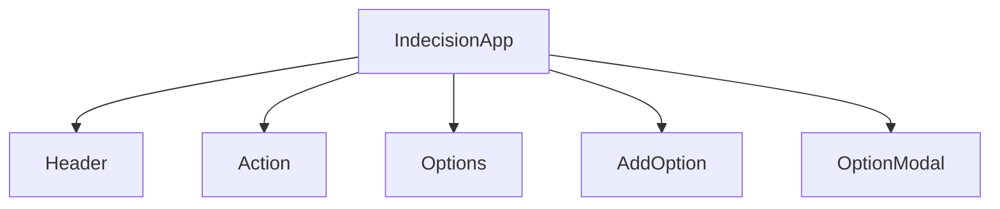

# Design Document

## Overview

This design covers the conversion of two class components — `IndecisionApp` and `AddOption` — to functional components using React hooks, and the removal of `defaultProps` from `Header`. The goal is to eliminate all class component patterns from the codebase while preserving identical runtime behavior.

The changes are purely structural refactors: no new features are added, no APIs change, and no child components are modified. The public interface of each component (props accepted, JSX rendered, behavior exposed) remains identical.

## Architecture

The component tree is unchanged. `IndecisionApp` remains the root component that owns all state and passes handlers down as props.



State ownership after conversion:

- `IndecisionApp` — owns `options` (array) and `selectedOption` (string | undefined) via `useState`
- `AddOption` — owns `error` (string | undefined) via `useState`
- All other components remain stateless functional components

Side effects after conversion:

- `IndecisionApp` — two `useEffect` hooks replace `componentDidMount` and `componentDidUpdate`
  - Mount effect: reads from `localStorage`, runs once
  - Options-change effect: writes to `localStorage`, runs when `options` changes

## Components and Interfaces

### IndecisionApp

Converted from class to functional component. All handler functions become plain `const` arrow functions inside the component body.

```javascript
export default function IndecisionApp() {
  const [options, setOptions] = useState([]);
  const [selectedOption, setSelectedOption] = useState(undefined);

  // Mount: load from localStorage
  useEffect(() => { ... }, []);

  // Update: persist to localStorage
  useEffect(() => { ... }, [options]);

  const handleDeleteOptions = () => setOptions([]);
  const handleClearSelectedOption = () => setSelectedOption(undefined);
  const handleDeleteOption = (optionToRemove) => setOptions(...);
  const handlePick = () => setSelectedOption(...);
  const handleAddOption = (option) => { ... };

  return ( /* identical JSX */ );
}
```

Props: none (root component)

### AddOption

Converted from class to functional component. The `handleAddOption` event handler becomes a plain function using a `ref` or the form's `elements` API.

```javascript
export default function AddOption({ handleAddOption }) {
  const [error, setError] = useState(undefined);

  const handleSubmit = (e) => {
    e.preventDefault();
    const option = e.target.elements.option.value.trim();
    const result = handleAddOption(option);
    setError(result);
    if (!result) {
      e.target.elements.option.value = '';
    }
  };

  return ( /* identical JSX */ );
}
```

Props: `handleAddOption` (function) — same as before

### Header

No logic change. Only the `defaultProps` declaration is removed and replaced with a default parameter value.

```javascript
// Before
Header.defaultProps = { title: 'Indecision' };

// After
const Header = ({ title = 'Indecision', subtitle }) => ( ... );
```

## Data Models

### Options List

- Type: `string[]`
- Persisted to `localStorage` under the key `'options'` as a JSON string
- Initialized from `localStorage` on mount; falls back to `[]` on parse error or missing key

### Selected Option

- Type: `string | undefined`
- Held in component state only; not persisted
- Set by `handlePick`, cleared by `handleClearSelectedOption`

### AddOption Error

- Type: `string | undefined`
- Held in `AddOption` component state only
- Set to the error string returned by `handleAddOption`, or `undefined` on success

### localStorage Schema

```
Key:   "options"
Value: JSON.stringify(string[])
Example: '["Go for a walk","Read a book"]'
```

## Correctness Properties

*A property is a characteristic or behavior that should hold true across all valid executions of a system — essentially, a formal statement about what the system should do. Properties serve as the bridge between human-readable specifications and machine-verifiable correctness guarantees.*


### Property 1: localStorage round-trip on mount

*For any* array of strings stored in `localStorage` under the key `'options'`, mounting `IndecisionApp` should initialize the `options` state to that same array.

**Validates: Requirements 1.4, 3.7**

### Property 2: Options list persisted after change

*For any* valid option string added to the options list, after the state update completes, `localStorage.getItem('options')` should contain a JSON representation that includes the newly added option.

**Validates: Requirements 1.5, 3.1**

### Property 3: handleAddOption validation

*For any* string input, `handleAddOption` should return `undefined` if and only if the input is non-empty and not already present in the options list; otherwise it should return a non-empty error string.

**Validates: Requirements 1.7, 3.2, 3.3**

### Property 4: handleDeleteOption removes only the target

*For any* options list and any option contained in that list, calling `handleDeleteOption` with that option should produce a new list equal to the original list with exactly that one item removed and all other items preserved in their original order.

**Validates: Requirements 1.8, 3.5**

### Property 5: handleDeleteOptions always produces empty list

*For any* options list (including empty), calling `handleDeleteOptions` should result in an empty options list.

**Validates: Requirements 1.9, 3.6**

### Property 6: handlePick selects a member of the list

*For any* non-empty options list, calling `handlePick` should set `selectedOption` to a value that is contained in the options list.

**Validates: Requirements 1.10, 3.4**

### Property 7: handleClearSelectedOption resets to undefined

*For any* state where `selectedOption` is set to a non-undefined value, calling `handleClearSelectedOption` should set `selectedOption` to `undefined`.

**Validates: Requirements 1.11**

### Property 8: AddOption trims input before calling prop

*For any* string input (including strings with leading or trailing whitespace), submitting the `AddOption` form should call the `handleAddOption` prop with the trimmed version of that string.

**Validates: Requirements 2.3**

### Property 9: AddOption reflects submission result

*For any* submission of the `AddOption` form, the displayed error state and input field value should reflect the result of `handleAddOption`: if an error string is returned the error is displayed and the input is unchanged; if `undefined` is returned the error is cleared and the input is reset to empty.

**Validates: Requirements 2.4, 2.5**

## Error Handling

### localStorage parse failure

`IndecisionApp` wraps the `localStorage.getItem` + `JSON.parse` call in a `try/catch` inside the mount `useEffect`. On any exception (invalid JSON, `localStorage` unavailable), the catch block is a no-op and `options` remains `[]`.

```javascript
useEffect(() => {
  try {
    const json = localStorage.getItem('options');
    const stored = JSON.parse(json);
    if (stored) setOptions(stored);
  } catch (e) {
    // silently ignore — options stays []
  }
}, []);
```

### handleAddOption validation errors

`handleAddOption` returns an error string (not throws) for invalid input. `AddOption` displays the returned string in the UI. No exceptions are thrown for user input errors.

### No error boundaries required

This refactor introduces no new async operations or render-time side effects that would require an error boundary. The existing behavior is preserved.

## Testing Strategy

### Approach

Use a dual testing strategy: **unit/example tests** for specific behaviors and edge cases, and **property-based tests** for universal invariants. The property-based testing library for this project is **fast-check** (JavaScript), which integrates with Jest.

Install: `npm install --save-dev fast-check`

### Unit Tests (React Testing Library)

Focus on specific examples, error messages, and structural rendering. These complement property tests by covering concrete scenarios.

Test files:
- `src/components/IndecisionApp.test.js`
- `src/components/AddOption.test.js`
- `src/components/Header.test.js`

Key unit test cases:
- `IndecisionApp` renders with empty options list when localStorage is empty
- `IndecisionApp` renders with options restored from localStorage on mount
- `IndecisionApp` renders with invalid localStorage JSON — falls back to empty list (edge case for Property 1)
- `AddOption` shows error "This option already exists" for duplicate input (Requirement 3.2)
- `AddOption` shows error "Enter valid value to add item" for empty input (Requirement 3.3)
- `Header` renders default title "Indecision" when no title prop is passed (Requirement 4.3)
- `IndecisionApp` renders correct JSX structure with all child components (Requirement 1.12)
- `AddOption` renders correct JSX structure (Requirement 2.6)

### Property-Based Tests (fast-check + Jest)

Each property test runs a minimum of **100 iterations**. Each test is tagged with a comment referencing the design property it validates.

Tag format: `// Feature: modernize-react-app, Property {N}: {property_text}`

Property test cases:

| Property | Test description | Generators |
|---|---|---|
| P1 | Mounting with any stored array restores options | `fc.array(fc.string())` |
| P2 | Adding any valid option persists it to localStorage | `fc.string({ minLength: 1 })` |
| P3 | handleAddOption returns undefined iff input is valid and non-duplicate | `fc.string()`, `fc.array(fc.string())` |
| P4 | handleDeleteOption removes only the target item | `fc.array(fc.string(), { minLength: 1 })` |
| P5 | handleDeleteOptions always produces empty list | `fc.array(fc.string())` |
| P6 | handlePick always selects a member of the list | `fc.array(fc.string(), { minLength: 1 })` |
| P7 | handleClearSelectedOption always resets to undefined | `fc.string({ minLength: 1 })` |
| P8 | AddOption trims input before calling prop | `fc.string()` with whitespace padding |
| P9 | AddOption error state and input reflect submission result | `fc.boolean()` (mock prop returns error or undefined) |

### Test Configuration

```javascript
// Example property test structure
import fc from 'fast-check';

test('P1: localStorage round-trip on mount', () => {
  // Feature: modernize-react-app, Property 1: localStorage round-trip on mount
  fc.assert(
    fc.property(fc.array(fc.string()), (options) => {
      localStorage.setItem('options', JSON.stringify(options));
      // render and verify
    }),
    { numRuns: 100 }
  );
});
```

### Running Tests

```bash
npm test                        # all tests
npm test -- -t "IndecisionApp"  # single component
```
