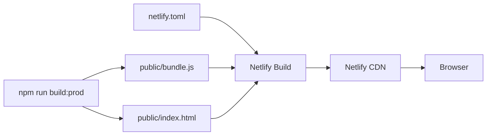

# Design Document: Netlify Static Deployment

## Overview

This refactor converts the Indecision App from an Express-served Node.js application into a pure static site deployable to Netlify's CDN. The changes are minimal and surgical: remove Express, add `netlify.toml`, update `webpack.config.js` to enable HMR and SPA fallback in dev, update `package.json` scripts, and delete `server/server.js`.

No application logic changes. No new runtime dependencies. The React app, webpack pipeline, and SCSS compilation remain untouched.

## Architecture

Before:

```
Developer → npm start → Express (port 3000) → serves public/
User      → Heroku    → Express (port $PORT) → serves public/
```

After:

```
Developer → npm run dev-server → webpack-dev-server (port 8080) → serves public/ with HMR
User      → Netlify CDN        → serves public/ directly (no server process)
```

The production deployment path becomes a simple static file push: `npm run build:prod` outputs to `public/`, Netlify picks that up and serves it from the CDN edge.



## Components and Interfaces

### netlify.toml (new file)

Controls Netlify's build and routing behavior.

- `[build]` section: specifies `command` and `publish` directory
- `[[redirects]]` section: SPA catch-all rule — all paths → `/index.html` with status 200

### webpack.config.js (modified)

Two additions to the existing `devServer` config:

- `historyApiFallback: true` — serves `index.html` for unmatched routes (SPA support in dev)
- `hot: true` — enables HMR (webpack-dev-server 4.x enables this by default, but explicit is clearer)

No changes to entry, output, loaders, or production config.

### package.json (modified)

- Remove `express` from `dependencies`
- Replace `"start": "node server/server.js"` with `"start": "webpack serve --mode development"` (or remove it — the existing `dev-server` script already covers local dev)
- Remove `heroku-postbuild` script (no longer deploying to Heroku)

### server/server.js (deleted)

File removed entirely. No replacement needed — its only job was serving `public/` statically, which webpack-dev-server and Netlify both handle natively.

## Data Models

No data model changes. This refactor is purely infrastructure — the React component tree, state management, and routing logic are unchanged.

The only "data" that changes shape is the `package.json` dependency graph: `express` moves from `dependencies` to absent.

## Correctness Properties


*A property is a characteristic or behavior that should hold true across all valid executions of a system — essentially, a formal statement about what the system should do. Properties serve as the bridge between human-readable specifications and machine-verifiable correctness guarantees.*

This feature is primarily a configuration and file-deletion refactor. The acceptance criteria are concrete, static assertions about file contents and project structure rather than universal properties over a range of inputs. All testable criteria are therefore expressed as examples rather than property-based tests.

After prework analysis and redundancy reflection, the criteria consolidate into 7 example checks:

### Property 1: No Express runtime dependency

For any checkout of the refactored project, `package.json` must not list `express` in `dependencies`, and the `start` script must not reference `server.js` or the express binary.

**Validates: Requirements 1.2, 1.3, 5.1**

### Property 2: netlify.toml build section is correct

For the `netlify.toml` file in the project root, the `[build]` section must specify `command = "npm run build:prod"` and `publish = "public"`.

**Validates: Requirements 2.1, 2.2**

### Property 3: netlify.toml SPA redirect covers all paths

For the `netlify.toml` file, a `[[redirects]]` entry must exist with `from = "/*"`, `to = "/index.html"`, and `status = 200`.

**Validates: Requirements 2.3**

### Property 4: webpack devServer config supports local static development

For the `webpack.config.js` devServer configuration, `port` must equal `8080`, `hot` must be `true`, and `historyApiFallback` must be `true`.

**Validates: Requirements 4.1, 4.2, 4.3**

### Property 5: index.html references the compiled bundle

For the `public/index.html` file, a `<script>` tag must reference `bundle.js`.

**Validates: Requirements 3.3**

### Property 6: server.js is absent

For the refactored project, the file `server/server.js` must not exist on disk.

**Validates: Requirements 5.2**

### Property 7: Production build emits bundle to public/

For a run of `npm run build:prod`, the file `public/bundle.js` must be produced and `public/index.html` must exist.

**Validates: Requirements 3.1, 3.2**

## Error Handling

This refactor introduces no new error paths in application code. The relevant failure modes are build-time and configuration errors:

- **Missing `historyApiFallback`**: Client-side routes return 404 in dev. Mitigated by explicit config and a test (Property 4).
- **Missing SPA redirect in netlify.toml**: Deep-linked URLs return 404 on Netlify. Mitigated by Property 3.
- **express still in package.json**: Bloats the dependency tree but doesn't break the build. Caught by Property 1.
- **server.js still present**: Harmless but confusing. Caught by Property 6.
- **CSS not loading**: If `style-loader` is misconfigured, styles won't inject. The existing webpack config is unchanged so this risk is low; Property 7 validates the build succeeds.

## Testing Strategy

All tests for this feature are configuration/file-system assertions. No property-based testing library is needed — these are deterministic, single-value checks best expressed as Jest unit tests.

**Unit tests (Jest)**:

Each of the 7 correctness properties maps to one Jest test. Tests read files from disk (or check file existence) and assert on their contents. No mocking required.

```
tests/
  netlify-static-deployment/
    config.test.js   # Properties 1–4: package.json, netlify.toml, webpack.config.js
    output.test.js   # Properties 5–7: public/index.html, server.js absence, build output
```

Test tagging format (comment above each test):
`// Feature: netlify-static-deployment, Property <N>: <property_text>`

**No property-based tests**: All acceptance criteria are static structural assertions, not universal properties over generated inputs. The `fast-check` library (already in devDependencies) is not needed for this feature.

**Integration smoke test** (manual, not automated):
1. `npm run build:prod` — verify `public/bundle.js` is emitted
2. `npm run dev-server` — open `http://localhost:8080`, verify app loads and HMR works
3. Push to Netlify — verify deep-linked routes resolve to the app

**Test execution**:
```bash
npm test -- -t "netlify-static-deployment"
```
